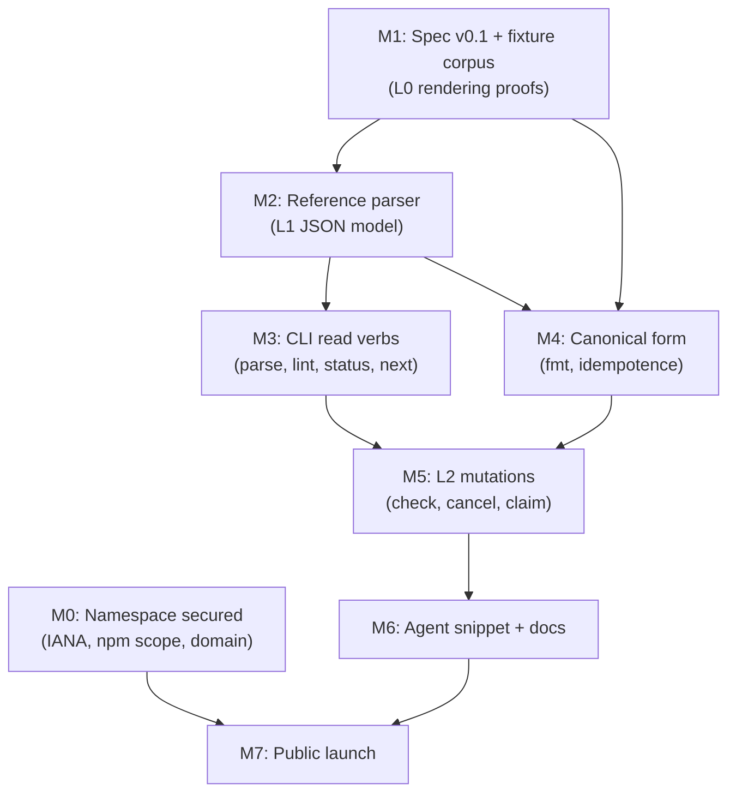

# MVP Definition

*The smallest buildable slice of MDC — Markdown Checklists — that lets a person or an agent author, render, parse, and mutate a checklist, defined by goals, explicit non-goals, concrete components, user stories, success criteria, and dependency-ordered sequencing.*

This document is the actionable heart of the planning set. It operationalizes the format decisions in the [format sketch](../spec/mdc-format-sketch.md), inherits its constraints from the [naming and extension decisions](../research/extension-naming-conflicts.md), and feeds directly into the [experiment plan](experiment-plan.md). For why this scope and not a larger one, see [standards adoption lessons](../research/standards-adoption-lessons.md) and the [risks and critiques](../vision/risks-critiques-open-questions.md).

## Goals

The MVP exists to prove one sentence:

> A developer or agent can author the canonical example, render it perfectly on GitHub with zero tooling, and — with the CLI — parse it to JSON, see what's next, claim an item, and check it, producing a one-line diff.

Everything in scope serves that sentence. Specifically, the MVP must:

1. **Prove L0 by construction.** Every MDC document is byte-for-byte valid [GFM](https://github.github.com/gfm/#task-list-items-extension-) and renders correctly on GitHub, GitLab, VS Code, and Obsidian with no tooling installed.
2. **Define L1 as a contract.** A canonical JSON item model, emitted by one reference parser, that any future tool (including the deferred [.mddb layer](../spec/mddb-concept-sketch.md)) can consume without renegotiation.
3. **Demonstrate L2 as the differentiator.** Deterministic, minimal-diff mutations — checking, claiming, cancelling — where each edit touches exactly one item line. This is the property no incumbent format specifies (see [prior art](../research/prior-art-checklist-formats.md)) and the property that makes git merges and multi-agent concurrent writes tractable.
4. **Reach the beachhead consumer.** The first mass consumer is a coding agent operating on a repo with a human reviewing the diff (see [what MDC could unlock](../vision/what-mdc-could-unlock.md)). The MVP ships the teaching material that makes that happen on day one.
5. **Secure the name before the announcement.** The [CommonMark renaming saga](https://commonmark.org/) is the documented cost of announcing before securing identity; all namespace actions complete before anything goes public.

## Non-goals

Explicitly out of the MVP, with the reason each is out:

| Excluded | Why |
|---|---|
| MCP server and LSP | Fast-follows that wrap the same CLI verbs; building them first would delay the verbs they wrap |
| VS Code extension, web playground | Distribution polish; the format must prove itself with zero tooling first (that is the L0 pitch) |
| Second-language parser | Required before any 1.0 to prove the spec is implementable from its text, but not needed to prove the format |
| Importers/converters (Obsidian Tasks, todo.txt, VTODO, spec-kit/Kiro `tasks.md`) | Migration stories need the import-fidelity analysis first; see [open questions](../vision/risks-critiques-open-questions.md) |
| The entire .mddb layer | Constitutionally deferred; specifying ahead of demand is the death pattern documented in [markdown-database prior art](../research/prior-art-markdown-databases.md) |
| In-file audit/event log | Git history is the audit trail until .mddb exists |
| Recurrence scheduling engine | The `repeat` key ships as spec'd data only; execution is tool behavior |
| Roles, sign-offs, evidence capture, typed form fields, conditional show/hide | Process-Street-class semantics live above the format or in .mddb |
| GitHub App / CI merge-gate action | Strong candidate for the first fast-follow, not the MVP |
| Checklist-science linter rules beyond structural lint | Needs the structural linter to exist first |
| Git merge/diff drivers | The line-per-item merge unit should make plain git adequate for the MVP's concurrency claims |

The discipline here is deliberate: the [landscape map](../research/landscape-map.md) is full of formats that specified ahead of demand and died with rich, unused feature sets.

## Components

### 1. Spec v0.1 — executable and example-based

Written in the [CommonMark](https://spec.commonmark.org/) style: every rule is a testable example, and the spec document doubles as the conformance corpus. The corpus includes GitHub/GitLab rendering fixtures proving the L0 guarantee by construction, not by after-the-fact testing. The full syntax surface is defined in the [format sketch](../spec/mdc-format-sketch.md): required `mdc:` frontmatter key, strict GFM bracket grammar, one Pandoc-style attribute block per item, the closed set of reserved keys, and the three-state model (open / done / cancelled).

### 2. One reference parser — a remark plugin

A [remark/unified](https://github.com/remarkjs/remark) plugin rather than a from-scratch parser, riding remark's existing weekly-download base and plugin ecosystem exactly as MDX did. It emits the canonical JSON item model that *defines* L1 conformance: items with state, text, attributes, hierarchy, and computed-only derived fields (blocked, actionable, rollups — never stored, always computed).

### 3. One CLI — `mdc`

Exit codes are the workflow API. Verbs:

- `mdc fmt` — canonical form, idempotent; `--assign-ids` generates slugs
- `mdc lint` — duplicate IDs, dangling `needs=`, malformed attributes, non-canonical states
- `mdc parse --json` — the L1 model on stdout
- `mdc status` — computed rollups and blocked/actionable state
- `mdc check <id>` / `uncheck <id>` / `cancel <id> --reason` — the first L2-conformant mutations
- `mdc claim <id> --as <handle>` — atomic; fails if an assignee is already set
- `mdc next --json` — topological next-actionable, respecting `needs=` edges and `.gate` items

### 4. Agent teaching snippet

An [AGENTS.md](https://agents.md/)-style skill snippet that teaches coding agents the format and the CLI in one page. This is the kanban-md distribution channel: the beachhead user story (below) depends on an agent being able to learn the format from repo context alone.

### 5. Canonical example as living fixtures

The release-run example from the [format sketch](../spec/mdc-format-sketch.md) ships in the repo as executable fixtures — parsed, linted, formatted, and mutated in CI on every commit, and pasted into GitHub/GitLab to verify rendering.

### 6. Launch actions

Register `text/markdown; variant=mdc` in the [IANA Markdown Variants registry](https://www.iana.org/assignments/markdown-variants/markdown-variants.xhtml) (First-Come-First-Served under [RFC 7764](https://www.rfc-editor.org/rfc/rfc7764)), secure the npm scope (e.g. `@mdcspec/*`), and secure the domain — all before any public announcement.

## User stories

### Solo developer

*As a developer keeping a `TODO.mdc.md` in my repo, I want a checklist that renders as normal checkboxes on GitHub and gets smarter only when I ask it to.*

- I write `- [ ] fix the flaky test` with no attributes and it is a complete, valid MDC item.
- I add `{#flaky due=2026-08-01}` when I need an ID or a date; nothing forced me to earlier.
- `mdc next` tells me the topologically next actionable item; `mdc check flaky` produces a one-line diff I can commit.
- If I never install the CLI, the file is still a pleasant markdown checklist everywhere — I have lost nothing.

### OSS maintainer

*As a maintainer running releases, I want a release checklist template whose runs are reviewable artifacts in the repo.*

- I keep `templates/release.mdc.md` (`kind: template`) and cut each release as a run file referencing `template: templates/release.mdc.md@5`.
- Contributors see progress rendered natively in the PR — no dashboard, no external tool.
- Skipped steps are cancelled with a machine-readable `reason=`, distinct from done, and excluded from rollups — the run records *why*, not just *whether*.
- `mdc status` in CI gives me computed progress and blocked state; `.gate` items express "nothing below proceeds until this is terminal."
- Every state change is a one-line diff with a git author — the audit trail is the git log.

### AI-agent harness

*As an agent harness, I want a task file both my agents and their human supervisor read and write safely, concurrently.*

- The harness detects MDC in-band via the `mdc:` frontmatter key — detection survives stdin, gists, and context windows; the filename is irrelevant.
- An agent runs `mdc next --json`, picks an item, and `mdc claim step-3 --as agent-a`. The claim is atomic: a second agent claiming the same item fails with a nonzero exit code and moves on. This is the concurrency primitive.
- `mdc check step-3` after the work; the mutation touches exactly one line, so two agents editing different items merge cleanly under plain git.
- The human reviews the run as ordinary diffs. Nothing the agent did is invisible or out-of-band.

## Success criteria

The MVP passes when all of the following hold:

1. **The MVP-test sentence is demonstrable end-to-end** on the canonical example, by a human following the README and by an agent following only the teaching snippet.
2. **L0 fixtures render correctly** on GitHub and GitLab: every open item shows a checkbox, every done item shows a checked box, cancelled items render struck-through, and no attribute block breaks rendering.
3. **`mdc fmt` is idempotent** — a second run on any corpus document is a byte-level no-op.
4. **Mutations are minimal-diff** — every L2 verb changes exactly the target item's line, verified across the whole corpus in CI.
5. **`claim` is provably atomic** — concurrent claims on one item yield exactly one success.
6. **Round-tripping is lossless** — all bytes outside frontmatter and task lines survive parse→serialize unchanged.
7. **The corpus is the spec** — every normative rule in spec v0.1 has at least one executable example, and CI runs them all.
8. **Namespace is secured** — IANA variant registered, npm scope and domain held — before any public link exists.

## Sequencing

Ordered by dependency only. Milestones can overlap where the graph allows; nothing here implies duration.

- **M0 — Namespace secured.** No dependencies; cheap; must complete before M7. Started first because it is the only externally-gated item.
- **M1 — Spec v0.1 and fixture corpus.** Depends on the [format sketch](../spec/mdc-format-sketch.md) decisions being frozen. The corpus includes the canonical example and the GitHub/GitLab rendering fixtures; L0 is proven here, before any code exists.
- **M2 — Reference parser.** Depends on M1: the corpus is the parser's test suite. Deliverable is the L1 JSON model, which is also the interchange contract .mddb will later consume.
- **M3 — CLI read verbs.** Depends on M2. `parse`, `lint`, `status`, `next` require no mutation semantics and can ship as soon as the parser is trustworthy.
- **M4 — Canonical form.** Depends on M1 and M2: `fmt` rules (attribute order, whitespace, quote normalization) must be pinned in the corpus, because L2 byte-determinism is only claimable against canonical-form documents.
- **M5 — L2 mutations.** Depends on M3 and M4. `check`, `uncheck`, `cancel`, `claim`, `set-attr`, `assign-id` — each verified minimal-diff and byte-deterministic against the corpus.
- **M6 — Agent snippet and documentation.** Depends on M5: the snippet teaches verbs that must already be stable.
- **M7 — Public launch.** Depends on M0 and M6, and on the killer-app sequencing question in [open questions](../vision/risks-critiques-open-questions.md) being answered — the launch leads with either the agent/human shared task file or the release-checklist story, not both at once.

The first post-MVP candidates — MCP server, LSP, CI gate action, importers — are scoped in the [experiment plan](experiment-plan.md), which also defines the observations that decide whether they get built at all.
