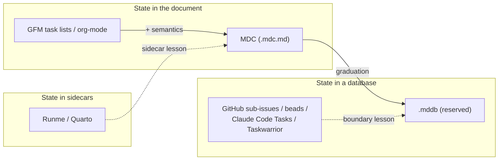

# Landscape Map: Where Markdown Checklists Sits

*A synthesis of every neighboring territory — runnable documents, agent task formats, plain-text checklist dialects, and markdown-as-database tooling — and a positioning statement for where MDC (Markdown Checklists, `*.mdc.md`) fits among them. Start here for context; the sibling research docs go deep on each region.*

Research snapshot: 2026-07-26

## The territory at a glance

Every system that puts task or process state near a text document makes the same three choices: where the *definition* lives, where *instance state* lives (checked, assigned, timestamped), and where *derived or execution artifacts* live (outputs, rollups, history). The landscape sorts cleanly by those choices:

MDC's position in one sentence: it standardizes the semantic layer that plain markdown checklists lack, while refusing to absorb the relational and execution layers that belong in sidecars or databases.

## Region 1: Checklist syntaxes in plain text

The substrate is settled. [GFM task list items](https://github.github.com/gfm/#task-list-items-extension-) (`- [ ]` / `- [x]`) are a formal extension in section 5.3 of GitHub's spec, rendered interactively by GitHub, GitLab, Obsidian, and VS Code, with progress counts computed by the platform — [clicking a checkbox mutates the markdown source](https://docs.github.com/en/get-started/writing-on-github/working-with-advanced-formatting/about-task-lists). Around that substrate sits a fragmented dialect zoo: [org-mode](https://orgmode.org/manual/Checkboxes.html)'s tri-state checkboxes and computed statistics cookies, [todo.txt](https://github.com/todotxt/todo.txt)'s line-oriented `key:value` grammar (2006, still alive), [\[x\]it!](https://github.com/jotaen/xit)'s five-state spec, TaskPaper's `@tag(value)`, and Obsidian Tasks' emoji microformat with ~3.7M downloads. Every pair of these is mutually unintelligible, and none combines stable IDs, dependencies, assignees, and recurrence in one markdown-compatible spec.

That gap — semantics, not syntax — is MDC's target. The full survey, including why GFM's strict two-state bracket grammar constrains our design, is in [prior-art-checklist-formats.md](./prior-art-checklist-formats.md).

## Region 2: Interactive and runnable documents

The runnable-docs lineage runs from [Knuth's literate programming](http://www.literateprogramming.com/knuthweb.pdf) (1983–84) through Jupyter to [Runme.dev](https://docs.runme.dev/getting-started/cli/), which executes fenced code blocks in ordinary markdown as notebook cells and CLI tasks. Each system teaches by scar tissue:

- **Jupyter** co-located source, outputs, and execution counts in one JSON file, and [spent a decade retrofitting merge tooling](https://www.fast.ai/posts/2022-08-25-jupyter-git.html) (nbdime, nbdev2) because git conflicts corrupted the container and derived state generated spurious diffs. Lesson: derived state is never stored; the container must survive line-based merges.
- **Runme** keeps execution outputs in a [separate session-output artifact](https://github.com/runmedev/runme/issues/701), attaches per-cell config as [fence-info annotations](https://docs.runme.dev/configuration/cell-level), and makes its [ULID identity insertion opt-in with a reset escape hatch](https://docs.runme.dev/configuration/lifecycle-identity) — users reject tools that rewrite their files. Lessons: outputs out of band; IDs visible and opt-in.
- **Quarto/R Markdown** push all execution state into [freeze/cache sidecars](https://quarto.org/docs/computations/caching.html), keeping the source pure — the cleanest definition/derived-state separation surveyed.
- **Runbook tooling** (Rundeck's YAML-definition/logged-execution split, [incident.io's automated runbooks](https://incident.io/blog/automated-runbook-guide)) shows static procedure docs decay unless something keeps them live. [Dan Slimmon's do-nothing scripting](https://blog.danslimmon.com/2019/07/15/do-nothing-scripting-the-key-to-gradual-automation/) supplies the adoption ladder MDC's `verify=` attribute encodes declaratively: each step graduates from manual prompt to machine-verified independently.

The single most instructive event in this region is GitHub itself: it built structured "tasklist blocks" inside markdown, then [retired them on April 30, 2025](https://github.blog/changelog/2025-02-18-github-issues-projects-february-18th-update/) in favor of database-backed sub-issues. The largest markdown platform on earth pre-ran the .mdc-to-.mddb arc and marked exactly where in-document complexity dies.

## Region 3: AI-agent task formats

This is the region where MDC expects its first users, and it is bifurcating.

**Camp one, plain markdown by convention:** [GitHub spec-kit](https://github.com/github/spec-kit/blob/main/spec-driven.md) derives `tasks.md` checklists with `[P]` parallelization markers; [AWS Kiro](https://kiro.dev/docs/specs/) builds its IDE identity on `requirements.md`/`design.md`/`tasks.md` with a real-time task-execution UI over checkboxes; [Cursor's Plan Mode](https://cursor.com/docs/agent/plan-mode) and Claude Code's plan mode persist editable markdown plans; [OpenSpec](https://github.com/Fission-AI/OpenSpec/) tracks change folders with task lists. All converge on GFM checkbox syntax plus ad-hoc filenames; none standardizes IDs, dependencies, status vocabulary, or safe machine updates. Instruction files consolidated fast — [AGENTS.md](https://agents.md/) went from launch to 60,000+ repos to the Linux Foundation's [Agentic AI Foundation](https://www.linuxfoundation.org/press/linux-foundation-announces-the-formation-of-the-agentic-ai-foundation) — but AGENTS.md deliberately carries no task-state semantics. The task-state slot in that standards portfolio is empty.

**Camp two, structured stores:** [Steve Yegge's beads](https://steve-yegge.medium.com/introducing-beads-a-coding-agent-memory-system-637d7d92514a) was built after "605 inscrutable plans" convinced him markdown TODOs are "write-only memory"; it now runs on an embedded Dolt database. Claude Code replaced its in-context todo tool with [persistent JSONL Task tools](https://code.claude.com/docs/en/agent-sdk/todo-tracking) supporting dependencies, owners, and cross-session coordination. [git-bug](https://github.com/git-bug/git-bug) stores issues as git objects; Task Master keeps `tasks.json` as source of truth and renders markdown only as a view.

Between the camps, hybrids like [kanban-md](https://github.com/antopolskiy/kanban-md) — markdown files with frontmatter, an atomic `pick --claim` for multi-agent parallelism, agent skills as the distribution channel — validate MDC's exact thesis: agents want commands and diffs, humans want readable files, and nothing neutral serves both. MDC's answer to camp two's critique is structural, not rhetorical: stable slugs, typed `needs=` dependencies, an atomic `claim` primitive, and L2 minimal-diff mutation semantics adopt precisely the features whose absence drove builders out of markdown — while keeping what JSONL and Dolt can never offer: PR-diffable, GitHub-rendered, human-editable text.

## Region 4: Markdown as database

The query-layer region has two proven architectures: index-and-query (Obsidian [Dataview](https://blacksmithgu.github.io/obsidian-dataview/), [MarkdownDB](https://markdowndb.com/)'s markdown-to-SQLite compiler, Taskwarrior's TaskChampion) and sidecar view definitions (Obsidian Bases' `.base` YAML files, already reimplemented outside Obsidian). Both treat markdown as the source layer and build derived, queryable projections beside it. This is the architectural lineage `.mddb` will join — reserved and constitutionally bounded now, designed later, as a projection of MDC's canonical L1 JSON item model rather than a second source of truth. See [prior-art-markdown-databases.md](./prior-art-markdown-databases.md) for the survey and [mddb-concept-sketch.md](../spec/mddb-concept-sketch.md) for the stance.

## The namespace overlay

One fact cuts across every region: the bare `.mdc` extension is colonized. Cursor [mandates `.mdc` for its rules files](https://forum.cursor.com/t/what-is-a-mdc-file/50417) ("Markdown Cursor"), Nuxt's MDC tooling registers the extension in VS Code, and GitHub Linguist assigns bare `.mdc` no language at all — no highlighting, no rendered markdown. Our decision: cede the bare extension permanently, keep the brand, use the double extension `*.mdc.md` (the [RFC 7764](https://www.rfc-editor.org/rfc/rfc7764) variant-prefix pattern), and make identity in-band via the required `mdc:` frontmatter key. `.mdb` is Microsoft Access, forever; the database companion is `.mddb`. Full collision evidence and the IANA `variant=mdc` registration plan are in [extension-naming-conflicts.md](./extension-naming-conflicts.md); the CommonMark/MDX/Djot adoption history that shaped these calls is in [standards-adoption-lessons.md](./standards-adoption-lessons.md).

## Positioning statement

**MDC is:** a strict superset of GFM task lists — every MDC document is a byte-for-byte valid markdown file that renders correctly everywhere with zero tooling — plus the standardized semantic layer no incumbent ships: in-band format identity (`mdc:` in frontmatter), one metadata serialization (a trailing `{#id .tag @assignee key=value}` attribute block), template-vs-run as a first-class distinction, typed dependencies with derived blocked state, mandatory-anchor recurrence, and deterministic minimal-diff mutations (`check`, `claim`, `cancel`) that make an item line the merge unit for humans, git, and concurrent agents alike.

**MDC is not:** a runner (execution output never enters the file — the Runme sidecar lesson); a database or query language (rollups are computed, history lives in git, relational needs graduate to `.mddb` — the GitHub sub-issues lesson); an agent-rules or instruction format (that is Cursor rules and AGENTS.md territory, and we cede both the niche and the bare extension); a project-management product (roles, sign-offs, evidence capture, and conditional logic live above the format); and not another unspecified TODO.md convention — it ships as an executable spec with a reference parser, a CLI, and an agent-teaching snippet, because [specifications follow platforms, not the reverse](./standards-adoption-lessons.md).

**MDC sits between:** GFM task lists below it (universal syntax, zero semantics) and structured task stores above it (beads, Claude Code Tasks, GitHub sub-issues — rich semantics, zero diffability). Horizontally, it sits between the runnable-document world (which executes but does not track procedure state) and the agent-task world (which tracks state but abandoned neutral, human-readable files). The wager, in full: there is durable value in a format that a human can read in any editor, GitHub can render unmodified, git can merge line-by-line, and an agent can mutate atomically — and that when a team outgrows it, the exit is a defined graduation into `.mddb`, not a rewrite.

## Where to go next

- Deep dives: [checklist formats](./prior-art-checklist-formats.md) · [markdown databases](./prior-art-markdown-databases.md) · [naming conflicts](./extension-naming-conflicts.md) · [standards adoption lessons](./standards-adoption-lessons.md)
- The format itself: [mdc-format-sketch.md](../spec/mdc-format-sketch.md) · [mddb-concept-sketch.md](../spec/mddb-concept-sketch.md)
- Why it matters and what could go wrong: [what-mdc-could-unlock.md](../vision/what-mdc-could-unlock.md) · [risks-critiques-open-questions.md](../vision/risks-critiques-open-questions.md)
- What we build first: [mvp-definition.md](../planning/mvp-definition.md) · [experiment-plan.md](../planning/experiment-plan.md)
- Index: [docs/README.md](../README.md)
